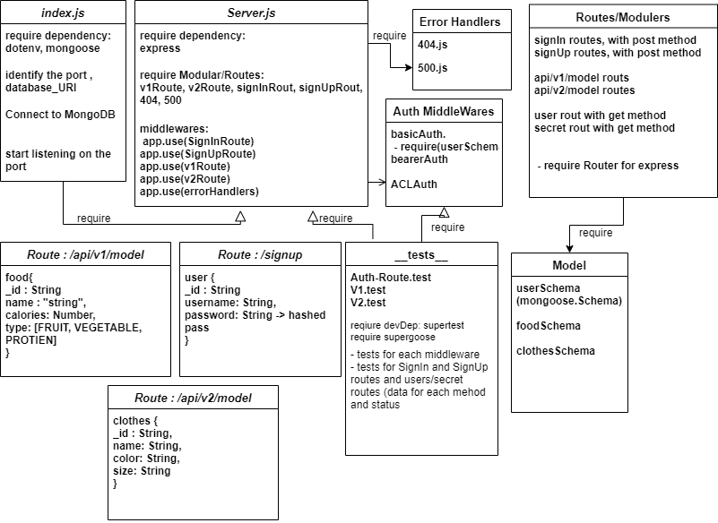

# auth-api

## Author: Nihad Zeidan

## tests report:

[GitHub PR](https://github.com/NihadZeidan/auth-api/pull/8)

[Heroku](https://nihad-auth-api.herokuapp.com/)

[GitHub Actions](https://github.com/NihadZeidan/auth-api/actions)

## .env requirements

PORT - Port Number

DataBase_URI=mongodb://localhost:27017/auth

SECRET="mysecret"

## Running the app
`npm run start`

## Endpoints: 

post `/signin`

post `/signup`

get `/users`

get `/secret`

CRUD `/api/v1/model` 

CRUD `/api/v2/model` 

## Returns Object

  user {
    "_id": "String",
    "username": "String",
    "password": "String",
    "role": "String"
  }

foodModel {
    name: String,
    calories: Number,
    type: enum
}

clothesModel {
    name: String,
    color: String,
    size: String
}

## Tests
Unit Tests: `npm test`

## UML

